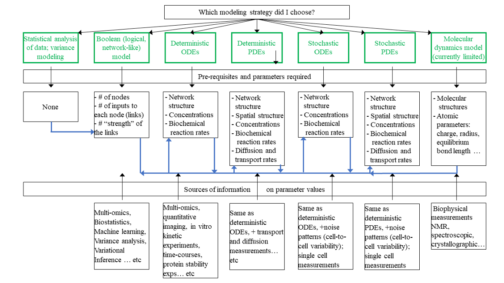

### Model parameters

Defining a reasonable architecture for the model(s) is guided by the general principles discussed in the previous section. Let's focus next on being able to make testable predictions. This requires to determine, or at least reasonably guess, model parameters. There are several techniques for experimental measurement and statistical inference of many types of model parameters (see Figure, green boxes). It is also possible to re-inject model parameters inferred by certain types of modeling into other types of modeling (Figure, blue arrows).

It is important to keep in mind that regardless of the statistical method used to extract model parameters from a dataset, those parameters will be generally tied to the model, and caution must be used when using these parameters in another model. A simple illustration of this statement is road traffic: assume you measure the traffic between Espoo and Helsinki, counting the number of cars N making this trip during an hour. If this data is fitted with a road network model including only the main highway number 1, then the fitted model parameter “number of cars on highway #1 per hour” will be N. If you fit the same data with another road network model that includes all secondary routes, the same parameter “number of cars on highway #1 per hour” will be definitely less than N, as many cars will use other routes within the network. Thus, the same parameter extracted from the same dataset can be very different depending on the model used to fit the data. In return, using a given set of parameters in slightly different networks can produce very different outputs, as illustrated for instance when comparing the Caenorhabditis elegans brain wiring diagram (connectome) with a random network (see dedicated C.elegans connectome Jupyter notebook).  

### Conclusion:

There is no, or should not be, strict separation between descriptive and predictive science. Indeed, just like the pioneering flights ending up with crashed airplanes certainly helped to improve the design of the wings, observing how cells react to drugs improve our understanding of cell biology, even if drugs have not been designed with a systems-level strategy. Cycles of cell description/cell treatment/cell response analysis/treatment adjustment, the so called, trial and error process, indeed improve our understanding of cellular systems. But owing to the many parameters relevant to the biological response, many of which are not controlled in experiments, purely qualitative trial and error approaches are very time-consuming and cost-ineffective. Even the simplest predictive mathematical models have the potential to improve our experiment design, by providing experiment rationales that sits on solid quantitative grounds to test the biological hypothesis underlying the model design. Simple mathematical models can tell if a putative biological mechanism is quantitatively plausible, and suggest non-intuitive, indirect ways to test key assumptions of the mechanism that would be impossible by direct experimental testing. 

Additional reading: 
Babtie, A. C., & Stumpf, M. (2017)  How to deal with parameters for whole-cell modelling. Journal of the Royal Society Interface, 14(133), 20170237. https://doi.org/10.1098/rsif.2017.0237
